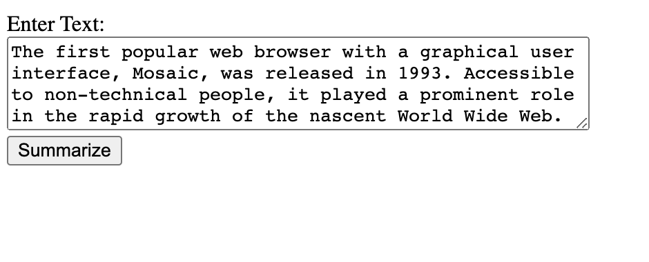

# IDS706-Individual-Project4: Flask Text Summarization App

## Overview

This project features a web-based text summarization application built with Flask. The app leverages a pre-trained model from Hugging Face's `transformers` library to generate concise summaries of input text. This is particularly useful for distilling information from lengthy documents, making them more manageable for quick reads.

## Dependencies

- **Python**: The application is built using Python 3.8.
- **Flask**: Serves as the web framework for the application.
- **Hugging Face Transformers**: Provides the text summarization pipeline and pre-trained models.
- **Docker**: Used for containerizing the application, ensuring consistency across different environments.

## Running the Application

### Local Setup

1. **Clone the repository**:

   ```bash
   git clone https://github.com/carolxu369/IDS706-Individual-Project4.git
   ```

2. **Install dependencies**:

   ```bash
   pip install -r requirements.txt
   ```

3. **Run the application**:

   ```bash
   python app.py
   ```

   The app will be available at `http://10.197.11.175:5001/ ` on your local machine (or the address revealed in your terminal window). Make sure port 5001 is not in use.

### App Function

1. **Enter the text that you want to get a summarization**:
  


2. **Get the summarized text**:
  


### Docker Setup

1. **Build the Docker image**:

   ```bash
   docker build -t my-flask-app .
   ```

2. **Run the Docker container**:

   ```bash
   docker run -p 5001:5001 my-flask-app
   ```

   The app will be available at `http://127.0.0.1:5001/` on your local machine.

3. **Host the functioning container on DockerHub**:
  
    I also tag my docker image to my DockerHub, where you can pull and run.

    

### Deploy to Azure Web App

I also successfully deployed my container via Azure Web App to a public endpoint, where you can access through `http://127.0.0.1:5001/`. 


## Conclusion and Recommendations

The text summarization app can significantly enhance productivity by enabling quick comprehension of extensive documents. This has wide applications across various departments like research, legal, and customer service, where time constraints are prevalent.

### Recommendations:

1. **Integrate With Existing Systems**: Embed the app into internal portals or tools for direct access by the team members.
2. **Training**: Conduct training sessions to familiarize employees with the app's functionalities and benefits.
3. **Feedback Loop**: Establish a feedback mechanism to continuously improve the summarization quality based on user experiences.
4. **Scalability**: As usage grows, consider scaling the app using Azure's auto-scaling features to maintain performance.
5. **Security**: Ensure all text processed by the app is handled securely, especially if sensitive data is involved.